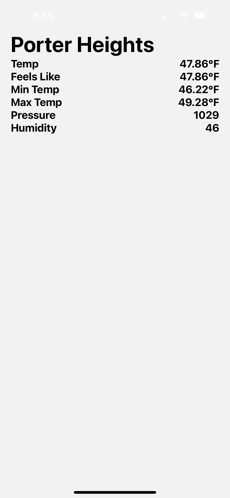

# Welcome to your Expo app 👋

## Requirements
- Fetch and display current weather from an API (e.g., OpenWeatherMap).
- Show temperature, location, and weather icon.

## Things to Use
- useEffect for API calls.
- Fetch API or axios.

## Acceptance Criteria
- Weather data is fetched and displayed accurately.
- App shows a loading indicator while fetching.

## Get started

1. Install dependencies

   ```bash
   npm install
   ```

2. Start the app

   ```bash
    npx expo start
   ```

## Image

